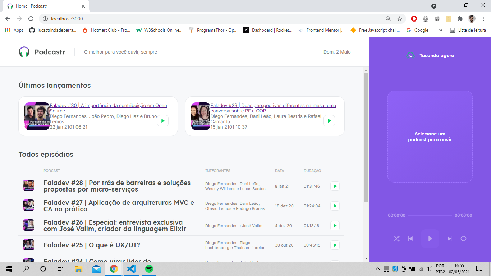

### Podcastr



### Sobre o projeto


Projeto feito durante a NLW#5. A ideia dessa aplicação é reunir todo conteúdo do falaDev(podcast da rocketseat) em um único lugar com toda funcionalidade de um player music. Criado em Typescript e React usando o next js para geração de páginas estáticas. 


## Tecnologias

Foram usadas as seguintes tecnologias para construção do projeto:

- [TypeScript](https://www.typescriptlang.org/)
- [React](https://pt-br.reactjs.org/)
- [Styled-components](https://styled-components.com/)
- [Nextjs](https://nextjs.org/)
- [Axios](https://www.npmjs.com/package/axios/)
- [Json-server](https://www.npmjs.com/package/json-server)
- [Sass](https://sass-lang.com/)
- [Rc-slider](https://www.npmjs.com/package/rc-slider)
- [Date-fns](https://date-fns.org/)


### Pré-requisitos

Antes de começar, você vai precisar ter instalado em sua máquina as seguintes ferramentas:
[Git](https://git-scm.com), [Node.js](https://nodejs.org/en/).
Além disto é bom ter um editor para trabalhar com o código como [VSCode](https://code.visualstudio.com/)

###  Rodando o projeto

```bash
# Clone este repositório
$ git clone https://github.com/lucastrindadebarra/moveit-next.git

# Acesse a pasta do projeto no terminal/cmd
$ cd podcastr

# Instale as dependências
$ yarn
# ou
$ npm install

# Execute a Api de teste 
$ yarn server

# Execute a aplicação em modo de desenvolvimento
$ yarn start
# ou
$ npm run start

```
